<!-- MAGAZINE:BEGIN COVER -->
<picture>
  <source media="(prefers-color-scheme: dark)" srcset="assets/magazine-cover-dark.svg">
  <source media="(prefers-color-scheme: light)" srcset="assets/magazine-cover-light.svg">
  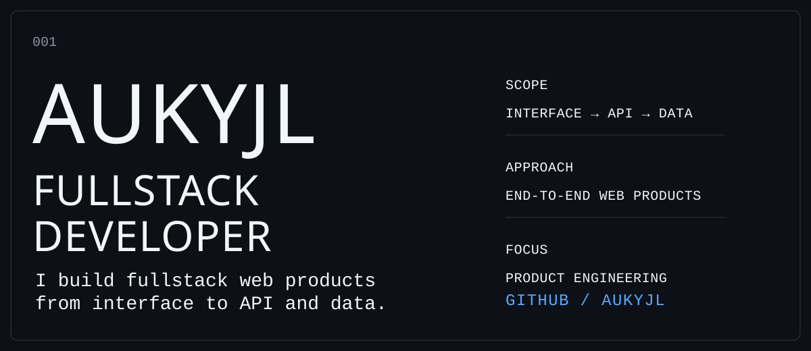
</picture>
<!-- MAGAZINE:END COVER -->

<!-- MAGAZINE:BEGIN PRACTICE -->
<picture>
  <source media="(prefers-color-scheme: dark)" srcset="assets/magazine-practice-dark.svg">
  <source media="(prefers-color-scheme: light)" srcset="assets/magazine-practice-light.svg">
  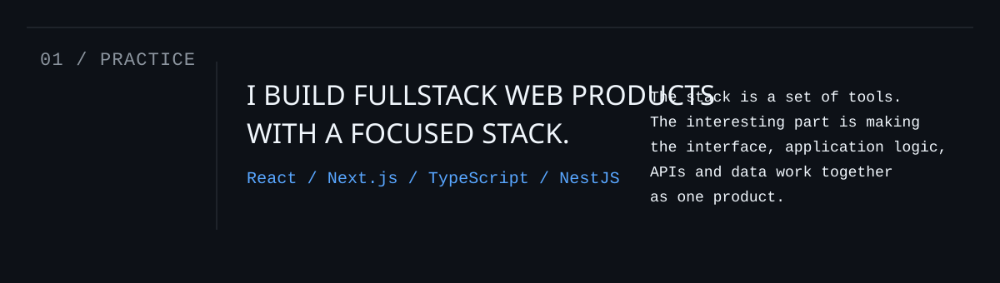
</picture>
<!-- MAGAZINE:END PRACTICE -->

<!-- MAGAZINE:BEGIN CORE_STACK -->
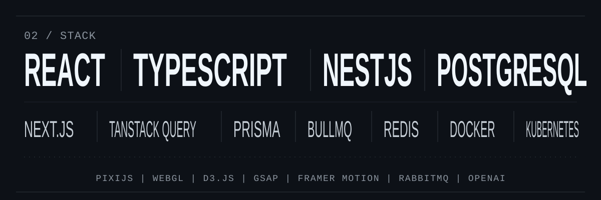
<!-- MAGAZINE:END CORE_STACK -->

<!-- MAGAZINE:BEGIN CHESS_INTRO -->
<a href="https://github.com/AUKYJL/chess-coach-copilot">
  <picture>
    <source media="(prefers-color-scheme: dark)" srcset="assets/magazine-chess-intro-dark.svg">
    <source media="(prefers-color-scheme: light)" srcset="assets/magazine-chess-intro-light.svg">
    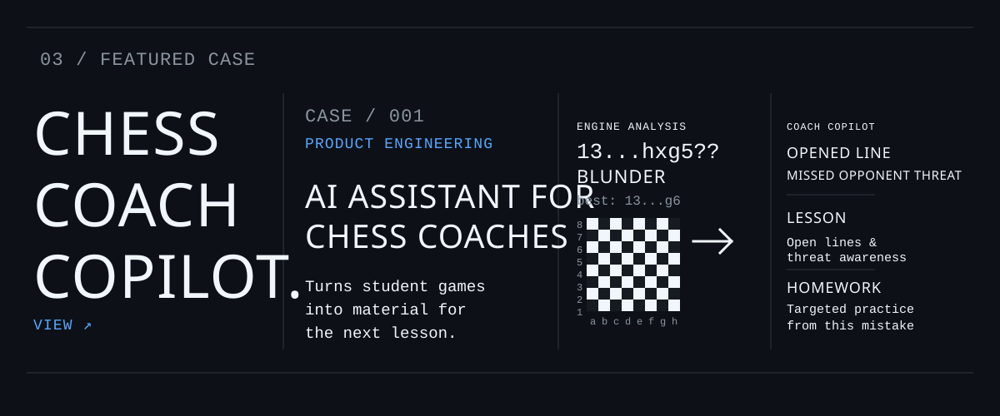
  </picture>
</a>
<!-- MAGAZINE:END CHESS_INTRO -->

<!-- MAGAZINE:BEGIN CHESS_FLOW -->
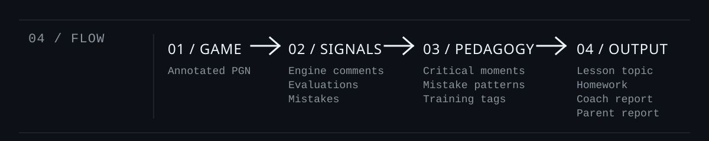
<!-- MAGAZINE:END CHESS_FLOW -->

<!-- MAGAZINE:BEGIN CHESS_ARCHITECTURE -->
<!-- MAGAZINE:END CHESS_ARCHITECTURE -->

<!-- MAGAZINE:BEGIN CHESS_CALLOUTS -->
<!-- MAGAZINE:END CHESS_CALLOUTS -->

<!-- MAGAZINE:BEGIN CHESS_OUTPUTS -->
<!-- MAGAZINE:END CHESS_OUTPUTS -->

<!-- MAGAZINE:BEGIN CHESS_BOUNDARY -->
<!-- MAGAZINE:END CHESS_BOUNDARY -->

<!-- MAGAZINE:BEGIN OTHER_WORK -->
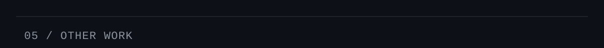
<p align="left">
  <a href="https://github.com/AUKYJL/krkp-fe">
    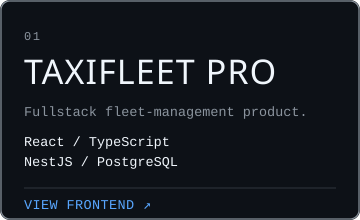
  </a>
  <a href="https://github.com/AUKYJL/url-checker">
    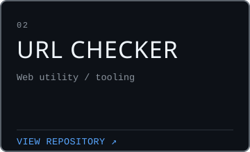
  </a>
  <a href="https://github.com/AUKYJL/rialtorg-v2">
    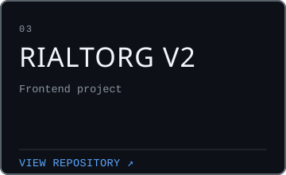
  </a>
</p>
<!-- MAGAZINE:END OTHER_WORK -->

<!-- MAGAZINE:BEGIN HOW_I_BUILD -->
<!-- MAGAZINE:END HOW_I_BUILD -->

<!-- MAGAZINE:BEGIN WORKING_SET -->
<!-- MAGAZINE:END WORKING_SET -->

<!-- MAGAZINE:BEGIN ACTIVITY -->
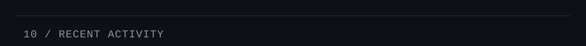

```text
2026-08-19  CREATE  polza                         branch main
2026-08-19  COMMIT  polza                25358ac  feat: add report
2026-08-19  COMMIT  polza                95974de  feat: add docker
2026-08-19  COMMIT  polza                cde115c  feat: add load review
2026-08-16  COMMIT  chess-coach-copilot  c3fcf78  refactor(be): simplify progress and analysis job types
```
<!-- MAGAZINE:END ACTIVITY -->

<!-- MAGAZINE:BEGIN FOOTER -->
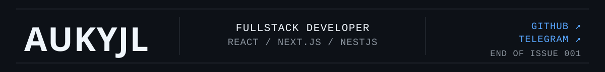
<a href="https://t.me/AUKYJL">
  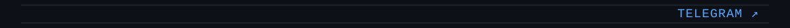
</a>
<!-- MAGAZINE:END FOOTER -->
